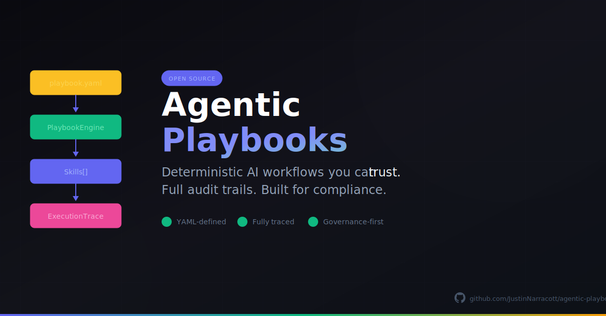
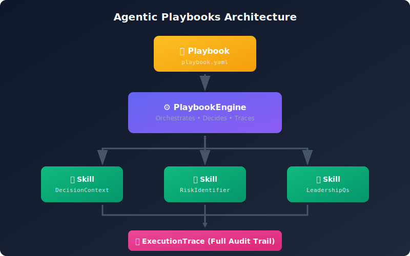

<p align="center">
  
</p>

<p align="center">
  <strong>Build transparent, auditable AI agent systems with explicit decision logic</strong>
</p>

<p align="center">
  <a href="LICENSE"></a>
  <a href="https://python.org"></a>
  <a href="https://codecov.io/gh/JustinNarracott/agentic-playbooks"></a>
  <a href="https://github.com/JustinNarracott/agentic-playbooks/actions"></a>
  <a href="https://github.com/JustinNarracott/agentic-playbooks/releases/tag/v1.0.0"></a>
</p>

---

## 🤔 Why Agentic Playbooks?

AI agents are powerful, but they're often **unpredictable**. When they make decisions, can you explain why? Can you audit them? Can leadership trust them?

<p align="center">
  
</p>

**Agentic Playbooks** brings order to agent chaos by providing a framework where:
- ✅ Every decision is **traceable and auditable**
- ✅ Decision logic is **explicit, not hidden in prompts**
- ✅ Workflows are **composable and reusable**
- ✅ Execution is **production-ready with metrics and observability**

---

## 🎯 How It Works

<p align="center">
  
</p>

### The Core Pattern

```
Skills (atomic capabilities)
    ↓
Playbooks (orchestrated sequences with explicit decision logic)
    ↓
Reasoning Traces (transparent, auditable execution)
```

### Real Example: AI Decision Audit

```python
from src.playbooks import PlaybookLoader, PlaybookEngine, MetricsCollector

# Load the AI decision audit playbook
loader = PlaybookLoader()
playbook = loader.load_from_file("playbooks/governance/ai_decision_audit.yaml")

# Execute with metrics tracking
metrics = MetricsCollector()
engine = PlaybookEngine(metrics=metrics)

trace = await engine.execute(playbook, {
    "decision_text": "Approved $500k loan for AI startup with 6-month runway..."
})

# Complete audit trail
print(f"Decision Summary: {trace.final_context['context_extraction']['context']['decision_summary']}")
print(f"Risk Level: {trace.final_context['risk_analysis']['analysis']['overall_risk_level']}")
print(f"Leadership Questions: {trace.final_context['leadership_review']['questions']}")
```

**Output:**
```json
{
  "decision_summary": "Loan approval for AI startup",
  "stakeholders": ["Credit Committee", "Risk Management", "Startup CEO"],
  "overall_risk_level": "high",
  "risks": [
    {
      "category": "financial",
      "severity": "high",
      "description": "Short runway increases default risk",
      "mitigation": "Require monthly cash flow reporting"
    }
  ],
  "leadership_questions": {
    "strategic": ["Does this align with our AI sector investment thesis?"],
    "ethical": ["Are we adequately assessing bias in AI credit models?"],
    "operational": ["What monitoring is in place for covenant compliance?"]
  }
}
```

---

## 🚀 Quick Start

```bash
# Clone the repository
git clone https://github.com/JustinNarracott/agentic-playbooks.git
cd agentic-playbooks

# Set up environment variables
cp .env.example .env
# Add your OPENAI_API_KEY to .env

# Start Docker development environment
cd docker && docker-compose up -d

# Run the example
docker exec -it playbooks-workspace python -c "
import asyncio
from src.playbooks import PlaybookLoader, PlaybookEngine

async def run():
    loader = PlaybookLoader()
    playbook = loader.load_from_file('../playbooks/governance/ai_decision_audit.yaml')
    engine = PlaybookEngine()
    trace = await engine.execute(playbook, {
        'decision_text': 'Approved loan application for tech startup...'
    })
    print(f'Success: {trace.success}')
    print(f'Steps executed: {len(trace.steps)}')

asyncio.run(run())
"

# Run tests
docker exec -it playbooks-workspace pytest tests/unit/ -v
```

---

## ✨ Key Features

### 🔧 Core Engine
- **PlaybookLoader** - Load and validate YAML playbook definitions with Pydantic models
- **PlaybookEngine** - Execute playbooks with skills and decision logic
- **ExecutionTracer** - Capture comprehensive execution traces with JSON export

### 🚀 Advanced Capabilities
- **CheckpointManager** - Save and resume long-running workflows
- **PlaybookValidator** - Validate playbooks before execution (syntax, references, logic)
- **PlaybookVisualizer** - Generate Mermaid and Graphviz workflow diagrams
- **BatchExecutor** - Process multiple inputs in parallel with concurrency control
- **MetricsCollector** - Track metrics with Prometheus and StatsD export

### 🎨 Skills Framework
- **SkillRegistry** - Centralized skill registration and discovery
- **Base Skill Class** - Standardized async execution with metadata
- **Governance Skills** - Pre-built AI decision governance:
  - `DecisionContextExtractor` - Extract context from AI decisions
  - `RiskIdentifier` - Identify and assess risks
  - `LeadershipQuestionsGenerator` - Generate strategic/ethical/operational questions

### 📊 Production Ready
- ✅ Comprehensive error handling with custom exception types
- ✅ 194 unit tests with 84% code coverage
- ✅ Full type hints and mypy validation
- ✅ Docker-based development environment
- ✅ Automated linting (black, ruff, mypy)
- ✅ CI/CD with GitHub Actions

---

## 📖 Documentation

- [**Architecture Guide**](docs/architecture.md) - Framework design and patterns
- [**Skills Reference**](docs/skills.md) - Complete skills documentation
- [**CHANGELOG**](CHANGELOG.md) - Version history and release notes
- [**Contributing**](CONTRIBUTING.md) - How to contribute to the project

---

## 🧩 Example Playbook

Here's the actual AI Decision Audit playbook from `playbooks/governance/ai_decision_audit.yaml`:

```yaml
metadata:
  name: ai_decision_audit
  version: 1.0.0
  description: Comprehensive audit of AI decisions for governance and compliance

variables:
  decision_text: ""

steps:
  - name: extract_decision_context
    type: skill
    skill: decision_context_extractor
    input:
      decision_text: "{{ decision_text }}"
    output_var: context_extraction

  - name: analyze_risks
    type: skill
    skill: risk_identifier
    input:
      decision_context: "{{ context_extraction.context }}"
    output_var: risk_analysis

  - name: generate_leadership_questions
    type: skill
    skill: leadership_questions_generator
    input:
      decision_context: "{{ context_extraction.context }}"
      risk_analysis: "{{ risk_analysis.analysis }}"
    output_var: leadership_review

  - name: assess_risk_level
    type: decision
    branches:
      - condition: "risk_analysis.analysis.overall_risk_level == 'critical' or risk_analysis.analysis.overall_risk_level == 'high'"
        steps:
          - name: flag_for_immediate_review
            type: skill
            skill: decision_context_extractor
            input:
              decision_text: "HIGH/CRITICAL RISK: Immediate review required"
            output_var: escalation_flag
```

---

## 🛠️ Development

### Prerequisites
- Docker & Docker Compose
- Python 3.11+
- Git

### Development Environment

```bash
# Start containers
cd docker && docker-compose up -d

# Enter workspace
docker exec -it playbooks-workspace bash

# Run tests
pytest tests/unit/ -v

# Run linters
black .
ruff check .
mypy src/
```

### Project Structure

```
agentic-playbooks/
├── src/
│   ├── playbooks/           # Core engine
│   │   ├── loader.py        # YAML playbook loader
│   │   ├── engine.py        # Execution engine
│   │   ├── tracer.py        # Execution tracing
│   │   ├── validator.py     # Playbook validation
│   │   ├── visualizer.py    # Workflow visualization
│   │   ├── batch.py         # Batch execution
│   │   ├── metrics.py       # Metrics collection
│   │   └── checkpoint.py    # Checkpoint/resume
│   ├── skills/              # Skill framework
│   │   ├── base.py          # Base skill class
│   │   └── registry.py      # Skill registry
│   └── modules/             # Domain modules
│       └── governance/      # AI governance skills
├── playbooks/               # YAML playbooks
│   └── governance/
│       └── ai_decision_audit.yaml
├── tests/                   # Tests
│   ├── unit/               # Unit tests (194 tests)
│   └── integration/        # Integration tests
├── docs/                    # Documentation
│   ├── architecture.md
│   ├── skills.md
│   └── images/
└── docker/                  # Docker setup
    └── docker-compose.yml
```

---

## 🗺️ Roadmap

### v1.0.0 ✅ (Current)
- Core playbook engine with skills and decision logic
- Execution tracing and audit trails
- Governance skills module (AI decision audit)
- Batch execution and metrics collection
- Checkpoint/resume for long-running workflows
- Playbook validation and visualization

### v1.1.0 (Planned)
- Additional skill modules (PMO, Sales, Transformation)
- Enhanced visualization with interactive diagrams
- Performance optimizations for large-scale batch processing
- Skill marketplace and community contributions

### v2.0.0 (Future)
- Web UI for playbook authoring and monitoring
- Real-time execution monitoring dashboard
- Advanced skill composition patterns
- Multi-tenant deployment support

---

## 📜 License

MIT License - see [LICENSE](LICENSE) for details.

---

## 🙏 Acknowledgments

Built on concepts from:
- [VoltAgent](https://voltagent.dev) - Agent framework patterns
- [Anthropic Claude](https://www.anthropic.com/claude) - AI capabilities
- [AgentKit](https://github.com/BCG-X-Official/agentkit) - Action plan routing

---

## 💬 Community

- **Issues**: [GitHub Issues](https://github.com/JustinNarracott/agentic-playbooks/issues)
- **Discussions**: [GitHub Discussions](https://github.com/JustinNarracott/agentic-playbooks/discussions)
- **Contributing**: See [CONTRIBUTING.md](CONTRIBUTING.md)

---

<p align="center">
  <strong>Ready to build auditable AI agents?</strong><br>
  <a href="https://github.com/JustinNarracott/agentic-playbooks/releases/tag/v1.0.0">Download v1.0.0</a> •
  <a href="docs/architecture.md">Read the Docs</a> •
  <a href="CONTRIBUTING.md">Contribute</a>
</p>

<p align="center">
  <em>Built with ❤️ by <a href="https://github.com/justinnarracott">Justin Narracott</a> and <a href="https://claude.com/claude-code">Claude Code</a></em>
</p>
