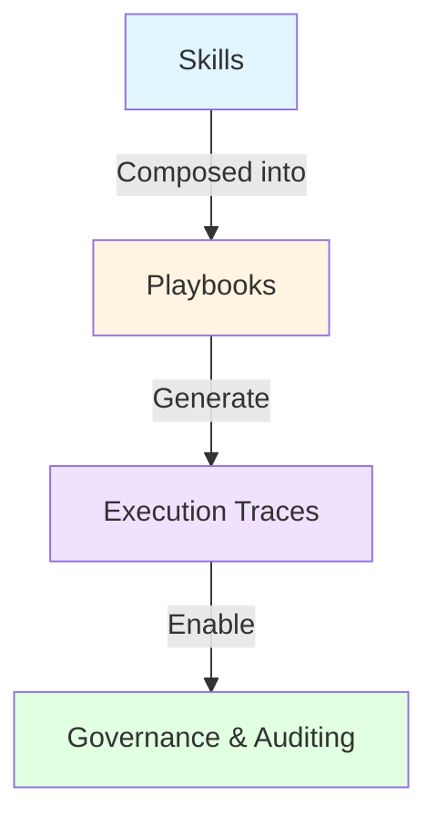
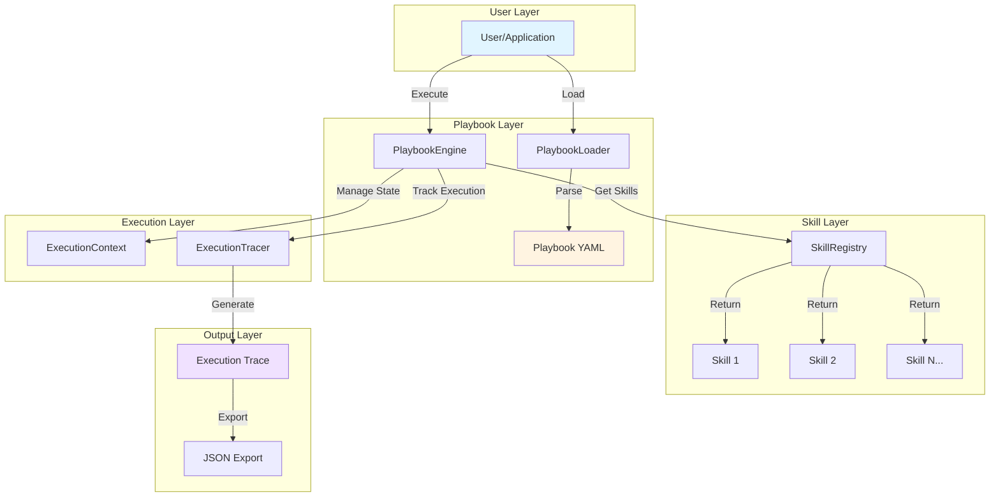
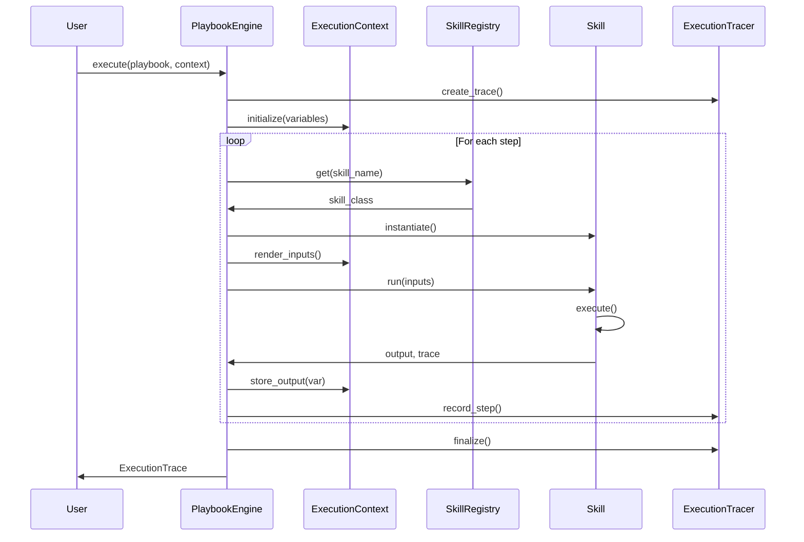
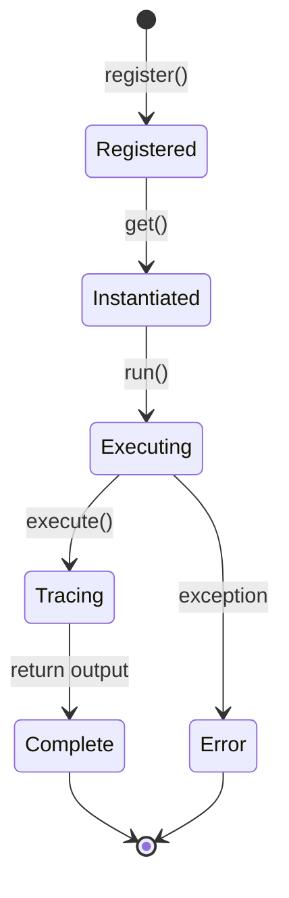
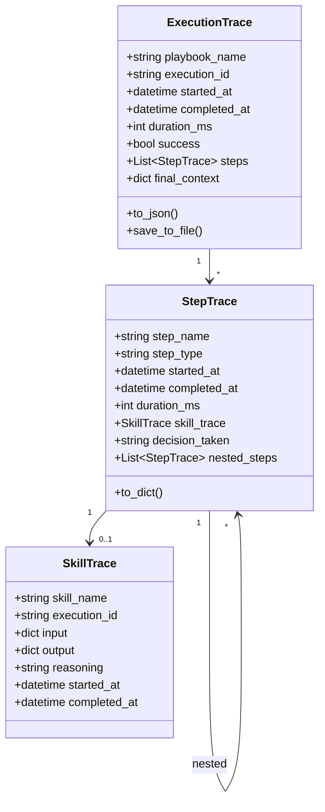

# Architecture

This document explains the architecture of the Agentic Playbooks framework and how to extend it.

## Table of Contents

- [Core Concepts](#core-concepts)
- [Architecture Patterns](#architecture-patterns)
- [Component Details](#component-details)
- [Extension Points](#extension-points)
- [Examples](#examples)

## Core Concepts

Agentic Playbooks is built on three foundational concepts:

1. **Skills** - Atomic capabilities that do one thing well
2. **Playbooks** - Workflows that compose skills into complex processes
3. **Traces** - Comprehensive audit trails of execution

### Skills > Playbooks > Traces Pattern



This pattern ensures:
- **Reusability**: Skills can be reused across multiple playbooks
- **Composability**: Complex workflows emerge from simple building blocks
- **Transparency**: Every decision is traced and auditable
- **Governance**: Complete visibility into AI agent behavior

## Architecture Patterns

### High-Level Architecture



### Playbook Execution Flow



## Component Details

### Skills

Skills are the atomic building blocks of the framework. Each skill:

- Extends the `Skill` base class
- Implements an `execute()` method
- Returns structured output
- Automatically generates execution traces

**Key Files:**
- `src/skills/base.py` - Base `Skill` class
- `src/skills/registry.py` - Skill registration and discovery

**Skill Lifecycle:**



### Playbooks

Playbooks define workflows by composing skills and decision logic:

- Written in YAML for human readability
- Support Jinja2 templates for dynamic values
- Include conditional branching with decision steps
- Define variables and context flow

**Key Files:**
- `src/playbooks/models.py` - Pydantic models for validation
- `src/playbooks/loader.py` - YAML parsing and loading
- `src/playbooks/engine.py` - Execution engine

**Playbook Structure:**

```yaml
metadata:
  name: my_playbook
  version: 1.0.0
  description: Example playbook

variables:
  input_var: default_value

steps:
  - name: step_1
    type: skill
    skill: skill_name
    input:
      param: "{{ input_var }}"
    output_var: result_1

  - name: decision_1
    type: decision
    branches:
      - condition: "result_1.value > 100"
        steps:
          - name: high_value_step
            type: skill
            skill: another_skill
    default:
      - name: low_value_step
        type: skill
        skill: default_skill
```

### Execution Context

The `ExecutionContext` manages state throughout playbook execution:

- Stores variables and outputs
- Renders Jinja2 templates
- Evaluates conditions
- Preserves data types (numeric, string, etc.)

**Key Features:**
- Variable scoping
- Template rendering with type preservation
- Conditional evaluation
- Nested dictionary support

### Execution Traces

Traces provide complete audit trails of execution:

- Capture timing information (start, end, duration)
- Record inputs and outputs for each step
- Track decision paths and branches
- Include error information when failures occur
- Export to JSON for storage and analysis

**Key Files:**
- `src/playbooks/tracer.py` - Trace classes and utilities

**Trace Structure:**



## Extension Points

The framework is designed for extensibility at multiple levels.

### 1. Creating Custom Skills

Skills are the primary extension point. Create a new skill by:

1. Extending the `Skill` base class
2. Implementing the `execute()` method
3. Registering with the `SkillRegistry`

**Example: Simple Skill**

```python
from typing import Any, Dict
from src.skills.base import Skill
from src.skills.registry import SkillRegistry

class DataValidator(Skill):
    """Validates data against business rules."""

    name = "data_validator"
    version = "1.0.0"
    description = "Validates data against defined rules"

    async def execute(self, input: Dict[str, Any]) -> Dict[str, Any]:
        """
        Validate data against rules.

        Args:
            input: {
                "data": dict - Data to validate
                "rules": list - Validation rules
            }

        Returns:
            {
                "valid": bool - Whether data is valid
                "errors": list - Validation errors if any
            }
        """
        data = input["data"]
        rules = input.get("rules", [])

        errors = []
        for rule in rules:
            # Implement validation logic
            if not self._check_rule(data, rule):
                errors.append(f"Failed rule: {rule}")

        return {
            "valid": len(errors) == 0,
            "errors": errors
        }

    def _check_rule(self, data: dict, rule: str) -> bool:
        # Implement rule checking logic
        return True

# Register the skill
registry = SkillRegistry.get_instance()
registry.register(DataValidator)
```

**Example: AI-Powered Skill**

```python
import os
from typing import Any, Dict
from openai import AsyncOpenAI
from pydantic import BaseModel
from src.skills.base import Skill

class SentimentAnalyzer(Skill):
    """Analyzes sentiment using OpenAI."""

    name = "sentiment_analyzer"
    version = "1.0.0"
    description = "Analyzes text sentiment using AI"

    def __init__(self) -> None:
        super().__init__()
        api_key = os.getenv("OPENAI_API_KEY")
        if not api_key:
            raise ValueError("OPENAI_API_KEY required")
        self.client = AsyncOpenAI(api_key=api_key)
        self.model = os.getenv("OPENAI_MODEL", "gpt-4o-mini")

    async def execute(self, input: Dict[str, Any]) -> Dict[str, Any]:
        """
        Analyze sentiment of text.

        Args:
            input: {"text": str}

        Returns:
            {
                "sentiment": str,  # positive/negative/neutral
                "confidence": float,
                "reasoning": str
            }
        """
        text = input["text"]

        response = await self.client.chat.completions.create(
            model=self.model,
            messages=[
                {
                    "role": "system",
                    "content": "Analyze sentiment. Return JSON with sentiment, confidence, reasoning."
                },
                {"role": "user", "content": text}
            ],
            response_format={"type": "json_object"}
        )

        result = json.loads(response.choices[0].message.content or "{}")

        # Store reasoning in trace for governance
        if self._trace:
            self._trace.reasoning = f"Analyzed with {self.model}: {result.get('reasoning')}"

        return result
```

### 2. Creating Custom Playbooks

Playbooks compose skills into workflows. Create new playbooks by:

1. Writing a YAML definition
2. Using existing skills
3. Adding conditional logic as needed

**Example: Customer Onboarding Playbook**

```yaml
metadata:
  name: customer_onboarding
  version: 1.0.0
  description: Automated customer onboarding workflow
  tags:
    - onboarding
    - customer

variables:
  customer_data: {}
  risk_threshold: 75

steps:
  # Step 1: Validate customer data
  - name: validate_data
    type: skill
    skill: data_validator
    input:
      data: "{{ customer_data }}"
      rules:
        - email_format
        - required_fields
    output_var: validation_result

  # Step 2: Decision based on validation
  - name: check_validation
    type: decision
    branches:
      - condition: "validation_result.valid == true"
        steps:
          # Step 3a: Assess risk
          - name: assess_risk
            type: skill
            skill: risk_assessor
            input:
              customer: "{{ customer_data }}"
            output_var: risk_assessment

          # Step 4a: Route based on risk
          - name: route_by_risk
            type: decision
            branches:
              - condition: "risk_assessment.score < risk_threshold"
                steps:
                  - name: auto_approve
                    type: skill
                    skill: account_creator
                    input:
                      customer: "{{ customer_data }}"
                    output_var: account

              - condition: "risk_assessment.score >= risk_threshold"
                steps:
                  - name: manual_review
                    type: skill
                    skill: review_queue
                    input:
                      customer: "{{ customer_data }}"
                      risk: "{{ risk_assessment }}"
                    output_var: review_ticket

    default:
      # Step 3b: Handle invalid data
      - name: notify_invalid
        type: skill
        skill: notification_sender
        input:
          type: validation_failed
          errors: "{{ validation_result.errors }}"
```

### 3. Custom Modules

Organize related skills into modules:

```
src/modules/
├── governance/          # AI governance skills
│   └── skills/
│       ├── decision_context_extractor.py
│       ├── risk_identifier.py
│       └── leadership_questions_generator.py
├── data_processing/     # Data processing skills
│   └── skills/
│       ├── data_cleaner.py
│       └── data_validator.py
└── notifications/       # Notification skills
    └── skills/
        ├── email_sender.py
        └── slack_notifier.py
```

### 4. Custom Trace Exporters

Extend tracing capabilities by consuming trace data:

```python
from src.playbooks.tracer import ExecutionTrace

class CustomTraceExporter:
    """Export traces to custom backend."""

    def export(self, trace: ExecutionTrace) -> None:
        """Export trace to database, monitoring system, etc."""
        trace_dict = trace.to_dict()

        # Send to monitoring system
        self.send_to_datadog(trace_dict)

        # Store in database
        self.store_in_database(trace_dict)

        # Alert on failures
        if not trace.success:
            self.alert_on_failure(trace_dict)
```

## Examples

### Example 1: Creating a Data Enrichment Skill

```python
"""CompanyEnricher - enriches company data from external API."""

from typing import Any, Dict
import httpx
from src.skills.base import Skill

class CompanyEnricher(Skill):
    """Enriches company data with firmographics."""

    name = "company_enricher"
    version = "1.0.0"
    description = "Enriches company data from Clearbit API"

    async def execute(self, input: Dict[str, Any]) -> Dict[str, Any]:
        """
        Enrich company data.

        Args:
            input: {"domain": str}

        Returns:
            {
                "name": str,
                "industry": str,
                "employee_count": int,
                "annual_revenue": int
            }
        """
        domain = input["domain"]

        async with httpx.AsyncClient() as client:
            response = await client.get(
                f"https://company.clearbit.com/v2/companies/find",
                params={"domain": domain},
                headers={"Authorization": f"Bearer {self.api_key}"}
            )
            response.raise_for_status()
            data = response.json()

        return {
            "name": data["name"],
            "industry": data["category"]["industry"],
            "employee_count": data["metrics"]["employees"],
            "annual_revenue": data["metrics"]["annualRevenue"]
        }
```

### Example 2: Creating a Sales Qualification Playbook

```yaml
metadata:
  name: sales_qualification
  version: 1.0.0
  description: Qualify sales leads using AI

variables:
  lead_data: {}

steps:
  - name: enrich_company
    type: skill
    skill: company_enricher
    input:
      domain: "{{ lead_data.company_domain }}"
    output_var: company_info

  - name: calculate_icp_score
    type: skill
    skill: icp_scorer
    input:
      company: "{{ company_info }}"
      lead: "{{ lead_data }}"
    output_var: icp_score

  - name: qualify_lead
    type: decision
    branches:
      - condition: "icp_score.score >= 80"
        steps:
          - name: create_opportunity
            type: skill
            skill: crm_opportunity_creator
            input:
              lead: "{{ lead_data }}"
              company: "{{ company_info }}"
              score: "{{ icp_score }}"
            output_var: opportunity

      - condition: "icp_score.score >= 50 and icp_score.score < 80"
        steps:
          - name: nurture_lead
            type: skill
            skill: marketing_automation
            input:
              lead: "{{ lead_data }}"
              campaign: warm_nurture
            output_var: nurture_campaign

    default:
      - name: disqualify_lead
        type: skill
        skill: lead_updater
        input:
          lead_id: "{{ lead_data.id }}"
          status: disqualified
          reason: "Low ICP score: {{ icp_score.score }}"
```

### Example 3: Testing Skills

```python
"""Test for CompanyEnricher skill."""

import pytest
from unittest.mock import AsyncMock, patch
from src.modules.data.skills.company_enricher import CompanyEnricher

@pytest.fixture
def mock_clearbit_response():
    return {
        "name": "Acme Corp",
        "category": {"industry": "Technology"},
        "metrics": {
            "employees": 500,
            "annualRevenue": 50000000
        }
    }

@pytest.mark.asyncio
async def test_company_enricher_success(mock_clearbit_response):
    """Test successful company enrichment."""

    with patch("httpx.AsyncClient") as mock_client:
        # Mock the API response
        mock_response = AsyncMock()
        mock_response.json.return_value = mock_clearbit_response
        mock_response.raise_for_status = AsyncMock()

        mock_client.return_value.__aenter__.return_value.get = AsyncMock(
            return_value=mock_response
        )

        # Execute skill
        skill = CompanyEnricher()
        output, trace = await skill.run({"domain": "acme.com"})

        # Verify output
        assert output["name"] == "Acme Corp"
        assert output["industry"] == "Technology"
        assert output["employee_count"] == 500

        # Verify trace
        assert trace.skill_name == "company_enricher"
        assert trace.error is None
```

## Best Practices

### Skill Design

1. **Single Responsibility**: Each skill should do one thing well
2. **Type Safety**: Use Pydantic models for input/output validation
3. **Error Handling**: Raise descriptive exceptions for failures
4. **Tracing**: Store reasoning in `self._trace.reasoning` for governance
5. **Testing**: Write comprehensive unit tests with mocks

### Playbook Design

1. **Modularity**: Break complex workflows into smaller playbooks
2. **Variables**: Use variables for configuration and reusability
3. **Naming**: Use descriptive names for steps and output variables
4. **Conditionals**: Leverage decision steps for branching logic
5. **Documentation**: Include clear descriptions in metadata

### Performance

1. **Async**: All skills use async/await for I/O operations
2. **Caching**: Cache expensive operations where appropriate
3. **Batching**: Batch API calls when possible
4. **Timeouts**: Set reasonable timeouts for external calls

### Governance

1. **Tracing**: Every execution generates a complete trace
2. **Reasoning**: AI skills should explain their outputs
3. **Audit**: Export traces to storage for compliance
4. **Monitoring**: Track execution times and error rates

## Conclusion

The Agentic Playbooks framework provides a flexible, extensible architecture for building governed AI agent systems. By following the Skills > Playbooks > Traces pattern, you can create complex, auditable workflows with transparency and control.

For more information, see:
- [Skills Reference](skills.md) - Complete reference for all built-in skills
